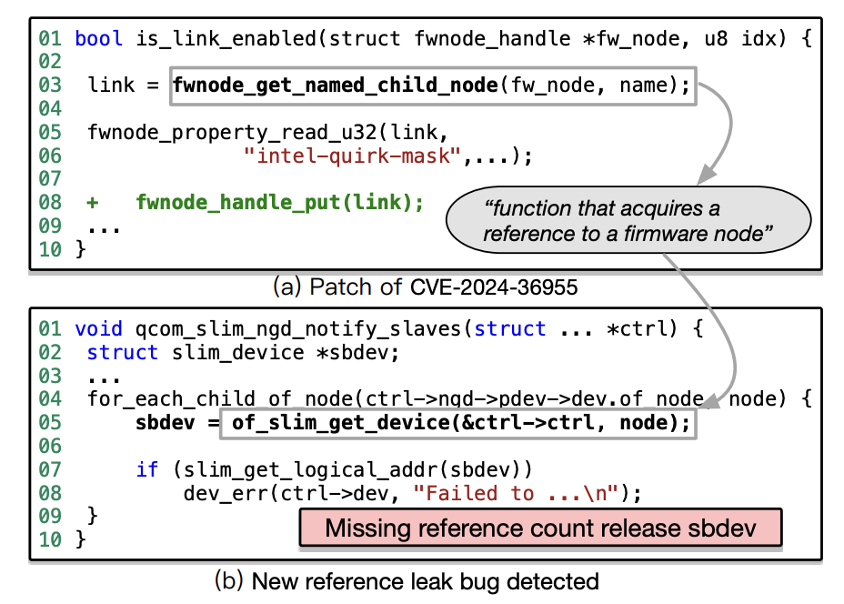

# Artifact Evaluation Guide

- [Artifact Evaluation Guide](#artifact-evaluation-guide)
  - [Setup](#setup)
  - [Evaluation At A Glance](#evaluation-at-a-glance)
  - [1. Minimal Running Example](#1-minimal-running-example)
    - [Run](#run)
    - [Compare](#compare)
    - [Expected Observations](#expected-observations)
  - [2. Evaluation For Specification Generation](#2-evaluation-for-specification-generation)
    - [Run](#run-1)
    - [Compare](#compare-1)
    - [Expected Observations](#expected-observations-1)
  - [3. Evaluation For Bug Detection](#3-evaluation-for-bug-detection)
    - [Run](#run-2)
    - [Compare](#compare-2)
    - [Expected Observations](#expected-observations-2)

## Setup

Use [INSTALL.md](./INSTALL.md) first.

## Evaluation At A Glance

| Workflow                   | Script                                     | Description                                                                                                                                             | Main output references                          |
| -------------------------- | ------------------------------------------ | ------------------------------------------------------------------------------------------------------------------------------------------------------- | ----------------------------------------------- |
| Functional minimal example | `artifact/functional/run.sh`               | Run the one-seed minimal example in `demo-assisted` or stricter `live` mode and inspect the generated specification plus bug-detection result.         | `artifact/functional/reference/*.csv`           |
| specification generation   | `artifact/reproduced_generation/run.sh`    | Run the packaged reproduced subset to verify that seed patches can be generalized into new concrete specifications.                                     | `artifact/reproduced_generation/reference/*`    |
| bug detection              | `artifact/reproduced_bug_detection/run.sh` | Run the packaged bug-detection benchmark to verify that the generated specifications can first localize and then identify new bugs in the Linux kernel. | `artifact/reproduced_bug_detection/reference/*` |

## 1. Minimal Running Example

The minimal example now focuses on a single seed patch, `c158cf914713`. This patch fixes a reference-management bug around `fwnode_get_named_child_node()`.
Starting from this seed patch, SpecAuditor extracts the seed rule, generalizes it, and generates a new concrete specification for `of_slim_get_device()`. It then uses this generated specification to detect the bug in `qcom_slim_ngd_notify_slaves()`.




### Run

We provide two modes for the minimal example:

- `demo-assisted` (default): this mode is intended for stable AE testing. It reuses the packaged similar-target retrieval result and keeps a fallback path in the specification-generation stage so the packaged target can still be tested.
- `live`: this mode runs the similar-target retrieval stage and the specification-generation stage live, and then uses the live-generated `of_slim_get_device` specification for bug detection.

To run the default `demo-assisted` mode:

```bash
bash artifact/functional/run.sh \
  --kernel-path /workspace/linux-v6.17-rc3
```

To run the stricter `live` mode:

```bash
bash artifact/functional/run.sh \
  --kernel-path /tmp/linux-v6.17-rc3 \
  --mode live
```

The `live` mode additionally requires `artifact/config/embedding.env`, as described in [INSTALL.md](./INSTALL.md). We provide an example embedding configuration there for this test.

Because the generalized description may vary across runs, the similar-target retrieval result may also change. For this packaged case, if the live generalized wording does not retrieve the packaged target, the runner retries stage3 with the original generalized query we obtained for this seed: `Function that acquires a reference to a firmware node`.

### Compare

| Output file                                      | What to check                                   | Reference                                                     |
| ------------------------------------------------ | ----------------------------------------------- | ------------------------------------------------------------- |
| `step1_specifcation_extraction_*.csv`            | extracted seed specification                    | `artifact/functional/reference/stage1_reference.csv`          |
| `step2_specifcation_generalization.csv`          | generalized specification                       | `artifact/functional/reference/stage2_reference.csv`          |
| `step3_similar_target_search.csv`                | stage3 retrieval result for the packaged target | `artifact/functional/reference/stage3_reference.csv`          |
| `step4_specification_generation_formatted.csv`   | generated specification for the packaged target | `artifact/functional/reference/stage4_reference.csv`          |
| `bug_detection_threaded_minimal*_simplified.csv` | normal stage5 output                            | `artifact/functional/reference/stage5_pipeline_reference.csv` |
| `targeted_bug_checks.csv`                        | short final demo summary                        | `artifact/functional/reference/stage5_targeted_reference.csv` |

### Expected Observations
- SpecAuditor extracts and generalizes a reference-release specification from `c158cf914713`
- In default `demo-assisted` mode, the run should produce the packaged `of_slim_get_device` specification and `targeted_bug_checks.csv` should contain `c158cf914713 -> of_slim_get_device -> qcom_slim_ngd_notify_slaves`
- In `live` mode, the runner should perform live similar-target retrieval, generate a live specification for `of_slim_get_device`, and then use that generated specification for bug detection.

Typical runtime is about `2-5 minutes`, depending on LLM latency.

## 2. Evaluation For Specification Generation

This reproduced subset validates the claim that SpecAuditor can generate many new concrete specifications from historical seed patches.

For AE, we use a fixed subset and its shipped references instead of the full paper-scale experiment. The packaged workflow starts from `12` seed patches. In the shipped reference, these seeds produce extracted and generalized seed specifications, and the full generation reference contains `77` generated specifications. The AE run uses a smaller subset of this workflow to keep runtime and token cost manageable while still showing that the extracted rules generalize into many mostly valid new specifications.

### Run

```bash
bash artifact/reproduced_generation/run.sh \
  --kernel-path /workspace/linux-v6.17-rc3
```

### Compare

| Output file                                    | What to check                                 | Reference                                                              |
| ---------------------------------------------- | --------------------------------------------- | ---------------------------------------------------------------------- |
| `step1_specifcation_extraction_*.csv`          | extracted seed specifications                 | `artifact/reproduced_generation/reference/seed_reference.csv`          |
| `step2_specifcation_generalization.csv`        | generalized specifications                    | `artifact/reproduced_generation/reference/seed_reference.csv`          |
| `step4_specification_generation_formatted.csv` | generated specifications for the quick subset | `artifact/reproduced_generation/reference/stage4_reference_subset.csv` |
| `reproduced_spec_generation_summary.json`      | summary counts for the packaged subset        | `artifact/reproduced_generation/reference/summary.json`                |

### Expected Observations

- SpecAuditor extracts seed specifications for the `12` packaged seeds and produce the corresponding generalized specifications
- SpecAuditor generates dozens of concrete specifications and they align semantically with the provided subset reference
- most generated rows should be semantically valid and consistent with the provided references, even if the exact wording differs
- `reproduced_spec_generation_summary.json` should be broadly consistent with `artifact/reproduced_generation/reference/summary.json`

Typical runtime is about `5-10 minutes`, depending on LLM latency and concurrent request throughput.

## 3. Evaluation For Bug Detection

This reproduced benchmark validates the claim that the extracted and generated specifications can detect real bugs.

Validating reported bugs often requires manual effort. In this artifact, we provide `48` true bug instances that we have already checked, so reviewers can automatically validate the main claim. We are still working through the remaining bugs outside this packaged benchmark.

- `artifact/reproduced_bug_detection/run_localization_check.sh`: run only AST/weggli-based candidate localization on the full benchmark and report whether each expected buggy function is in the candidate list
- `artifact/reproduced_bug_detection/run.sh`: run the full reproduced bug-detection workflow. In its default `localized` mode, it first localizes candidates and then audits a bounded candidate set per unique specification. `--mode targeted` is available as a lower-cost audit-only mode over the packaged benchmark rows.

Each row in `artifact/reproduced_bug_detection/datasets/checks.csv` provides the entity, the expected buggy function, and the specification used for bug detection.


### Run

Localization-only check:

```bash
bash artifact/reproduced_bug_detection/run_localization_check.sh \
  --kernel-path /workspace/linux-v6.17-rc3
```

Full bug-detection workflow:

```bash
bash artifact/reproduced_bug_detection/run.sh \
  --kernel-path /workspace/linux-v6.17-rc3 \
  --max-candidates-to-audit 10 \
  --max-workers 16
```
Notes:
- Localization runs over the Linux kernel codebase, so it takes longer. Runtime depends on CPU parallelism.
- `--max-candidates-to-audit` limits how many functions are audited for each unique specification. Larger values increase token cost because more code is analyzed.
- In our reference setup we use `--max-candidates-to-audit 10 --max-workers 16`.
- On a 64-core machine, this setting takes about `5 minutes` for the full localized run.

Optional fast mode:

```bash
bash artifact/reproduced_bug_detection/run.sh \
  --kernel-path /workspace/linux-v6.17-rc3 \
  --mode targeted
```


### Compare

| Output file                                                           | What to check                                                                               | Reference                                                                                                         |
| --------------------------------------------------------------------- | ------------------------------------------------------------------------------------------- | ----------------------------------------------------------------------------------------------------------------- |
| `reproduced_bug_detection_localization_probe.csv`                     | one row per packaged bug instance with the generated query and localization coverage result | `artifact/reproduced_bug_detection/reference/reproduced_bug_detection_localization_probe.csv`                     |
| `reproduced_bug_detection_localized_all_audited_candidates.csv`       | one row per audited candidate for each unique specification in default `localized` mode     | `artifact/reproduced_bug_detection/reference/reproduced_bug_detection_localized_all_audited_candidates.csv`       |
| `reproduced_bug_detection_localized_violation_reports.csv`            | candidates flagged as violations in the localized workflow                                  | `artifact/reproduced_bug_detection/reference/reproduced_bug_detection_localized_violation_reports.csv`            |
| `reproduced_bug_detection_localized_additional_violation_reports.csv` | flagged violations beyond the packaged expected buggy functions                             | `artifact/reproduced_bug_detection/reference/reproduced_bug_detection_localized_additional_violation_reports.csv` |
| `reproduced_bug_detection_localized_summary.json`                     | aggregate counts for the localized reference run                                            | `artifact/reproduced_bug_detection/reference/reproduced_bug_detection_localized_summary.json`                     |
| packaged bug-check dataset                                            | entity, expected buggy function, and applied specification                                  | `artifact/reproduced_bug_detection/datasets/checks.csv`                                                           |

If reviewers also run `bash artifact/reproduced_bug_detection/run.sh --mode targeted`, they can compare its outputs with:
- `artifact/reproduced_bug_detection/reference/reference.csv`
- `artifact/reproduced_bug_detection/reference/reference_summary.csv`
- `artifact/reproduced_bug_detection/reference/reference_summary.json`

### Expected Observations
- `run_localization_check.sh` should report that all `48` packaged buggy functions are successfully located. Reviewers can compare the live output with `artifact/reproduced_bug_detection/reference/reproduced_bug_detection_localization_probe.csv`.
- `run.sh` in default `localized` mode should detect most of the `48` packaged bug rows. In our reference run, it reports `48` localized buggy functions found, `18` audited unique specifications, `163` audited candidate rows, `72` violation reports, and `31` additional violation reports.
- Because LLM outputs vary across runs, the exact live counts may differ slightly. The localized run may also surface additional true bugs beyond the packaged benchmark rows.
- `run.sh --mode targeted` provides a lower-cost audit-only path, and its outputs should broadly overlap with `artifact/reproduced_bug_detection/reference/reference.csv`.
